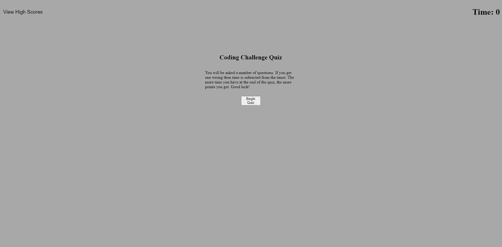

# Quiz-Game 

## Project Description
    This project was created using JavaScript, HMTL and CSS to create a functioning quiz game. This game uses DOM manipulation through JavaScript to update quiz questions, retain values and store them in localStorage. When and answer is wrong then 10 seconds will be subtracted from the time. Your final time remaining at the end of the quiz will be your score. 

## Production Link
[website](https://blitman12.github.io/QuizGame/)

## Screenshot

## License
 JavaScript, Code Logic and Styling
* © 2021 Bradley Litman 
